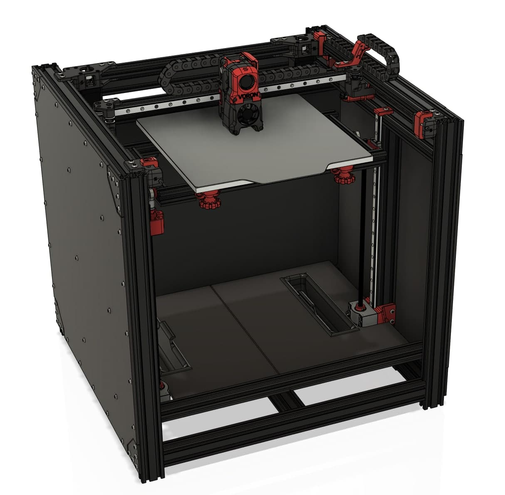
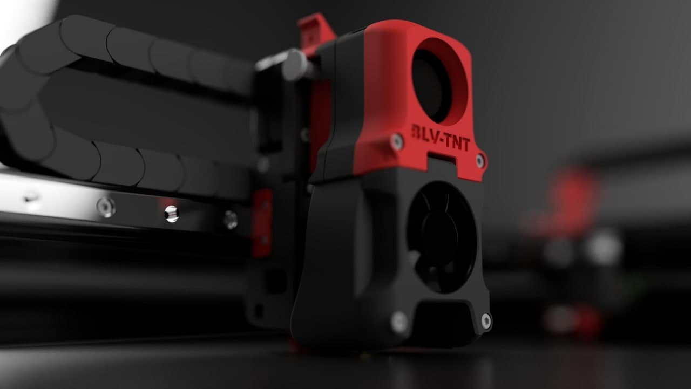

# BLV2TNT 
This project is based on Ben Levi's BLV Mgn Cube and Voron Trident projects.
 
 
 
 

This project is a conversion kit from a working BLV mgn cube (standard frame) to Trident kinematics.
You can leave your z kinematics, electronics end so on... because this conversion involves X/Y axis only.
The afteburner represented in pictures is only a placeholder, you can assembly every voron MGN12 compatible toolhead.
Enjoy.

 
 
 
 
